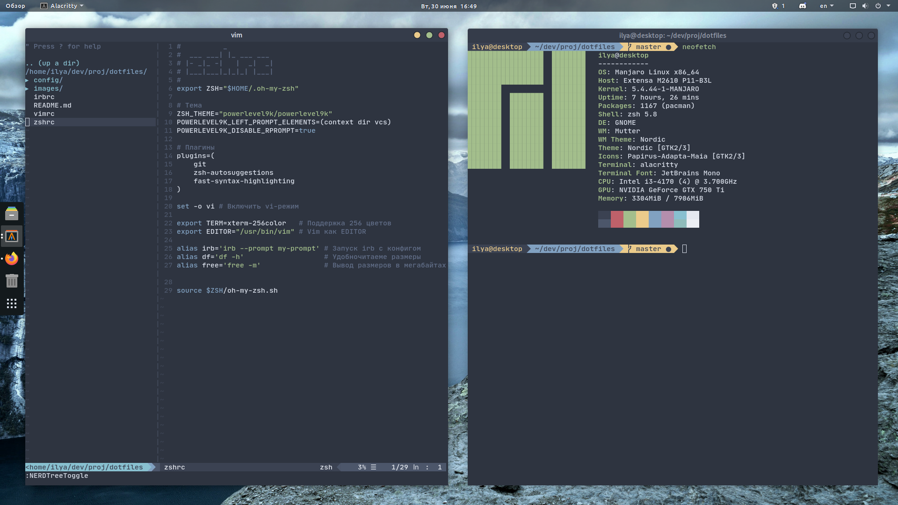
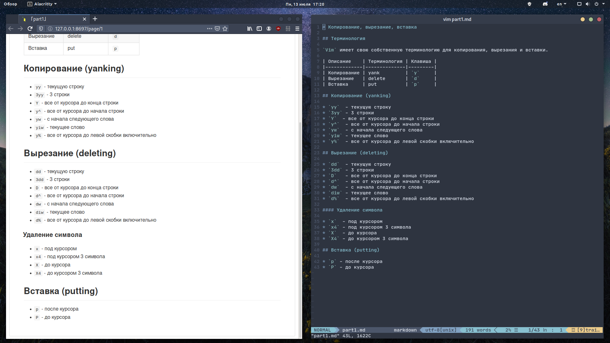

# Dotfiles

Dotfiles - это файлы настроек, которые используются для персонализации вашей Linux или другой системы на основе Unix. Они хранятся здесь для удобства, чтобы я мог быстро получить к ним доступ на новых машинах. Кроме того, другие могут найти некоторое из моих конфигураций полезным в настройке своих систем.

## Скриншоты

